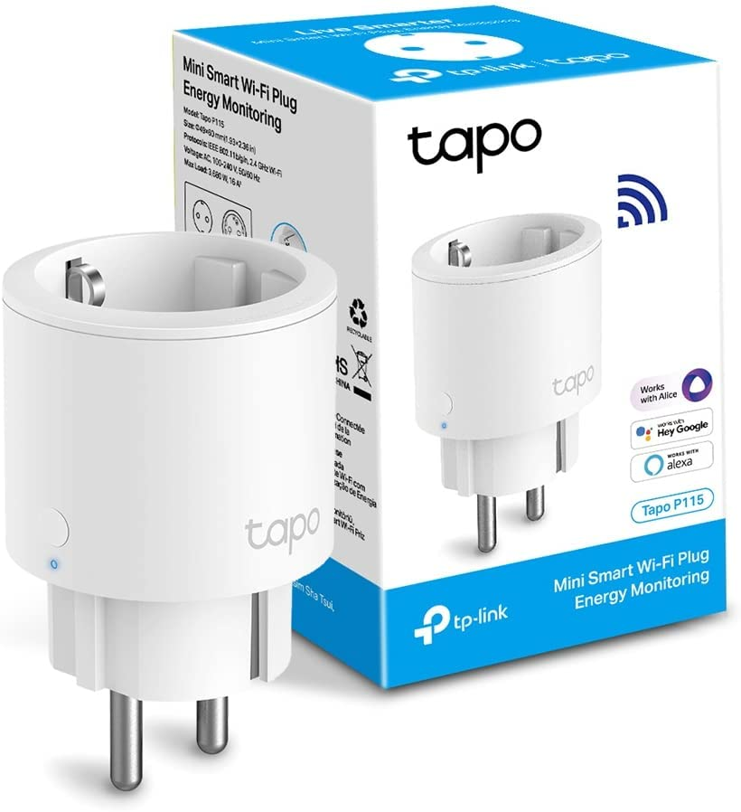
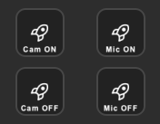
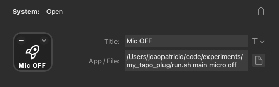

## Tapo Client

Control your Tapo Smart Plug from your terminal or StreamDeck.



You can then configure actions.



And have them run like so:



NOTE: The file has to have an extension - `.sh` in this case, or it will not work.

To get started:

```
./run.sh install
```

Inside main.py, add devices:

```
# Find this region and update:
---
# Device IP Addresses
device_ips = {
    "micro": "192.168.1.100",
    "camera": "192.168.1.101",
}
```

Generate a `env` file, and fill accordingly

```
cp .env.example .env
```

Now you can run commands on a device.

```
python3 main.py micro on
python3 main.py micro off
python3 main.py micro toggle
```

## Credits

Thanks to [PyP100](https://pypi.org/project/PyP100/)

